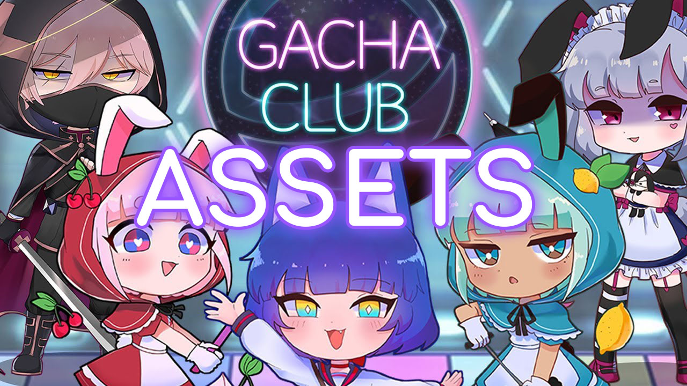

# Gacha Club assets
---

## Summary
I created this project so that everyone can freely access and use the unpacked files of **Gacha Club** for their own projects.

---
## Content
- [Fonts](Fonts/) *(TTF files)*
- [Scripts](Scripts/) *(ActionScript/AS files)*
- [Sounds](Sounds/) *(MP3 files)*
- **<u>Textures</u>** *(PNG and SVG files)*
    - [Backgrounds](Textures/Backgrounds/)
    - [Foregrounds](Textures/Foregrounds/)
    - [Objects](Textures/Objects/)
    - [Other things](Textures/Other%20things/)
    - [Pets](Textures/Pets/)
    - [Textboxes](Textures/Textboxes/)
    - [Unknown things](Textures/Unknown%20things/)
    - [<u>**Gacha character parts**</u>](Textures/Gacha%20character%20parts/)
        - [Body](Textures/Gacha%20character%20parts/Body/)
        - <u>Clothes</u>
            1. Accessory
                - [Face Accessory](Textures/Gacha%20character%20parts/Clothes/Accessory/Face%20Accessory/)
                - [Scarf](Textures/Gacha%20character%20parts/Clothes/Accessory/Scarf/)
                - [Shirt Logo](Textures/Gacha%20character%20parts/Clothes/Accessory/Shirt%20Logo/)
            2. Extra
                - [Knees](Textures/Gacha%20character%20parts/Clothes/Extra/Knees/)
                - [Shoulders](Textures/Gacha%20character%20parts/Clothes/Extra/Shoulders/)
                - [Wrist](Textures/Gacha%20character%20parts/Clothes/Extra/Wrist/)
            3. Hats
                - [Accessory](Textures/Gacha%20character%20parts/Clothes/Hats/Accessory/)
                - [Hats](Textures/Gacha%20character%20parts/Clothes/Hats/Glasses/)
                - [Hat](Textures/Gacha%20character%20parts/Clothes/Hats/Hat/)
            4. Lower
                - [Pants](Textures/Gacha%20character%20parts/Clothes/Lower/Pants/)
                - [Shoes](Textures/Gacha%20character%20parts/Clothes/Lower/Shoes/)
                - [Socks](Textures/Gacha%20character%20parts/Clothes/Lower/Socks/)
            5. Other
                - [Cape](Textures/Gacha%20character%20parts/Clothes/Other/Cape/)
                - [Gloves](Textures/Gacha%20character%20parts/Clothes/Other/Gloves/)
                - [Tail](Textures/Gacha%20character%20parts/Clothes/Other/Tail/)
                - [Wings](Textures/Gacha%20character%20parts/Clothes/Other/Wings/)
            6. Upper
                - [Belt-and-Skirt](Textures/Gacha%20character%20parts/Clothes/Upper/Belt-and-Skirt/)
                - [Jacket](Textures/Gacha%20character%20parts/Clothes/Upper/Jacket/)
                - [Shirt](Textures/Gacha%20character%20parts/Clothes/Upper/Shirt/)
                - [Sleeves](Textures/Gacha%20character%20parts/Clothes/Upper/Sleeves/)
        - <u>Head</u>
            1. Eyes
                - [Eyebrows](Textures/Gacha%20character%20parts/Head/Eyes/Eyebrows/)
                - [Eyes](Textures/Gacha%20character%20parts/Head/Eyes/Eyes/)
                - [Pupils](Textures/Gacha%20character%20parts/Head/Eyes/Pupils/)
            2. Face
                - [Blush](Textures/Gacha%20character%20parts/Head/Face/Blush/)
                - [Mouth](Textures/Gacha%20character%20parts/Head/Face/Mouth/)
                - [Nose](Textures/Gacha%20character%20parts/Head/Face/Nose/)
                - [Shadow](Textures/Gacha%20character%20parts/Head/Face/Shadow/)
            3. Hair
                - [Ahoge](Textures/Gacha%20character%20parts/Head/Hair/Ahoge/)
                - [Back Hair](Textures/Gacha%20character%20parts/Head/Hair/Back%20Hair/)
                - [Front Hair](Textures/Gacha%20character%20parts/Head/Hair/Front%20Hair/)
                - [Ponytail](Textures/Gacha%20character%20parts/Head/Hair/Ponytail/)
                - [Rear Hair](Textures/Gacha%20character%20parts/Head/Hair/Rear%20Hair/)
        - <u>Other</u>
            - [Props](Textures/Gacha%20character%20parts/Other/Props/)
            - [Shield](Textures/Gacha%20character%20parts/Other/Shield/)

---
## FAQ

### What is it?
These directories contains Gacha Club assets.

### Where are the other files?
The files are still being sorted, it will take time.

### In which file extension can I download?
PNG and SVG file formats.

---
### Download app
- Official page: [Gacha Club](https://gacha.club/)
- Windows: [Itch.io](https://lunime.itch.io/gacha-club)
- Android: [Google Play Store](https://play.google.com/store/apps/details?id=air.com.lunime.gachaclub)
- IOS: [Apple App Store](https://apps.apple.com/us/app/gacha-club/id1527025761)

